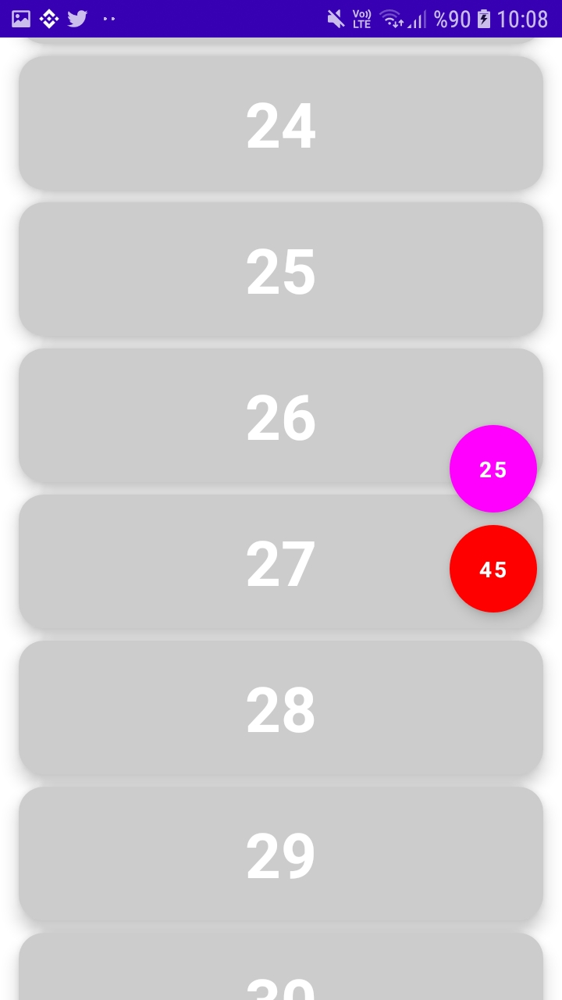

# LazyColumn

## 💫LazyColumnPosition

  
  
  
  
  

---------------------------------------------------

## içerik dolgusu
Bazen içeriğin kenarlarına dolgu eklemeniz gerekebilir. PaddingValues Tembel bileşenler, bunu desteklemek için bazılarını contentPaddingparametreye geçirmenize izin verir :

LazyColumn(
    contentPadding = PaddingValues(horizontal = 16.dp, vertical = 8.dp),
) {
    // ...
}

16.dpBu örnekte, yatay kenarlara (sol ve sağ) ve ardından 8.dpiçeriğin üstüne ve altına dolgu ekliyoruz .

Lütfen bu dolgunun içeriğe değil, içeriğe uygulandığınıLazyColumn unutmayın . Yukarıdaki örnekte, ilk öğenin 8.dp üstüne dolgu eklenecek, son öğe 8.dpaltına eklenecek ve tüm öğelerin 16.dpsolunda ve sağında dolgu olacaktır.

## içerik aralığı
Öğeler arasına boşluk eklemek için öğesini kullanabilirsiniz Arrangement.spacedBy(). Aşağıdaki örnek 4.dp, her bir öğenin arasına boşluk ekler:
LazyColumn(
    verticalArrangement = Arrangement.spacedBy(4.dp),
) {
    // ...
}

Benzer şekilde LazyRow:
LazyRow(
    horizontalArrangement = Arrangement.spacedBy(4.dp),
) {
    // ...
}

# List

## List1                                    
 

## List2                                    
                                   

# GridCell

## GridCellText

